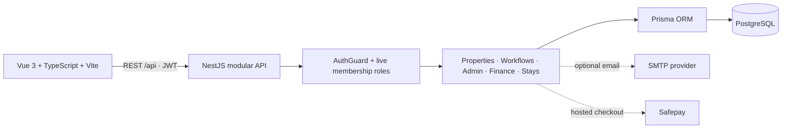
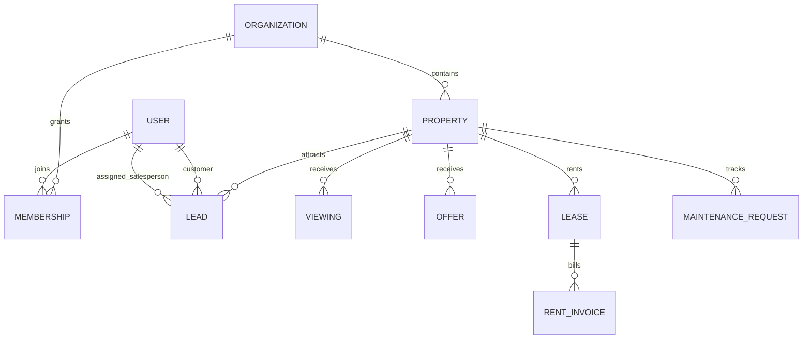

<p align="center">
  
</p>

<h1 align="center">PropSphere</h1>

<p align="center">One connected workspace for discovering, selling, renting, and managing property.</p>

<p align="center">
  
  
  
  
</p>

<p align="center"><a href="#quick-start">Quick start</a> · <a href="#system-architecture">Architecture</a> · <a href="#roles-and-access">Roles</a> · <a href="docs/screenshots/README.md">Project screenshots</a> · <a href="automation/README.md">Automation screenshots</a> · <a href="#local-configuration">Configuration</a> · <a href="#troubleshooting">Troubleshooting</a></p>

---

## Project at a glance

PropSphere is a multi-tenant real-estate marketplace and property operations platform. It connects public listings with the people and workflows behind them: buyers, tenants, owners, salespeople, sales managers, developers, vendors, finance teams, and organization admins. Its Pakistan demo inventory spans ten cities and residential, commercial, and industrial listings.

The product is organized into **five integrated phases**. Core marketplace, sales, property operations, development, stays, finance, and organization administration flows are implemented. Demo prices, photos, accounts, and addresses are illustrative and must not be treated as live real-estate offers.

## Quick start

Requirements: Node.js 20+, npm 10+, and Docker Compose. From the repository root:

```bash
cp .env.example .env
npm install
docker compose up -d postgres
npm run db:generate
npm run db:migrate
npm run db:seed
npm run dev
```

Open `http://127.0.0.1:5174`. The API is at `http://127.0.0.1:3002/api`, its health check is `/api/health`, and local Swagger is at `http://127.0.0.1:3002/docs`. Demo sign-ins and port configuration are in [Local setup](#local-setup).

## Product screens

| Area | Main screens |
| --- | --- |
| Marketplace | Home, search results, property details, saved properties, About, Features, Plans, Contact |
| Buyer and tenant | Overview, viewings, offers/applications, bookings, lease/payments, maintenance, messages |
| Owner and manager | Portfolio, properties/units, tenants/leases, rent ledger, maintenance, statements |
| Agent CRM | Leads, lead details, pipeline, viewings, offers, tasks |
| Developer | Projects, unit inventory, reservations, installment schedule |
| Vendor | Assigned jobs, job details, quotes, invoices |
| Finance | Payments, expenses, payouts, statements, reports |
| Admin | Overview, listing approvals, users/roles, risk flags, audit log, settings |
| Sales manager | Organization-wide sales team results and customer sales pipeline; cannot approve listings |
| Salesperson | Assigned customer leads, contact details, property prices, and personal follow-ups |

Screens share the same records and permissions. For example, an approved listing is searchable; a viewing creates an agent activity; an accepted rental application can become a lease; rent and maintenance costs flow into owner statements.

## Roles and access

Admins enter the separate **Admin Console** at `/admin` (or choose **Sign in as Admin** on the public sign-in screen). Its sidebar links to administration, listing approvals, and the organization workspace tools; server and route role checks still require an `ADMIN` membership. “Keep me signed in” stores the session in browser local storage for the selected token lifetime; leaving it unchecked keeps it in session storage. Password fields use the browser password manager through standard autocomplete hints; PropSphere never stores a plaintext password in browser storage.


Roles belong to an organization membership. The API checks the current membership on each authenticated request, so a role change takes effect without waiting for a token to expire. A user can belong to multiple organizations and switch the active workspace.

| Role | Can do | Restricted from |
| --- | --- | --- |
| Admin | Manage organization users/roles, review risk/audit/settings, approve or reject listings, and manage organization workflows | Cannot remove the last admin from the organization |
| Sales manager | View all organization salespeople, sales totals, customer contacts, linked properties/prices, and lead stages | Cannot approve listings or manage organization roles/settings |
| Salesperson (`AGENT`) | Work assigned customer leads, contact details, pipeline stages, notes, follow-ups, and assigned sales activity | Cannot view another salesperson’s leads or approve listings |
| Owner | Manage own portfolio, units, leases, rent, maintenance and owner finance views | Other owners’ private portfolio data |
| Buyer | Save listings/searches, contact listing teams, request viewings, submit offers, and track own applications | Other customers’ private records and organization controls |
| Tenant | View own lease/invoices, make eligible payments, request maintenance, and follow own bookings | Other tenants’ records and organization controls |
| Developer | Manage development projects, units, reservations, and installment schedules | Organization administration and listing approvals |
| Finance | Review authorized finance records, expenses, payouts, reservations, and vendor bills | Listing approvals and organization administration |
| Vendor | See assigned maintenance work and submit eligible job bills | Other vendors’ jobs and organization finance controls |

New public signups create a separate organization; the first member becomes its admin. Admins add an existing PropSphere account to their organization and choose that membership’s role. Role names in code stay simple: `ADMIN`, `SALES_MANAGER`, and `AGENT` (shown in the product as “Salesperson”), plus the marketplace and operations roles above.

## System architecture

PropSphere is a deliberately simple **modular monolith**: one Vue application, one REST API, and one PostgreSQL database. Business modules keep their own controllers and workflows while sharing Prisma persistence and the current organization membership.



### Request and data boundaries

1. A user signs in or creates a workspace. Login returns an eight-hour JWT by default; selecting “Keep me signed in” requests a 30-day JWT.
2. The Vue client sends the JWT as a Bearer token for authenticated API calls.
3. `AuthGuard` verifies the token and looks up the user's active organization membership; role authorization uses that live membership.
4. API services scope organization records using `organizationId` and apply user/assignment filters for private customer, owner, and salesperson records.
5. Prisma writes to PostgreSQL. Sensitive workflow changes use transactions/audit records where implemented.



## Developer map

| Path | Responsibility |
| --- | --- |
| `apps/web/src/views/` | Route-level Vue screens |
| `apps/web/src/components/` | Reusable listing cards and grids |
| `apps/web/src/router.ts` | Routes and client-side role-aware navigation |
| `apps/web/src/api.ts` | Axios API base URL and Bearer token attachment |
| `apps/web/src/style.css`, `workspace.css` | Shared marketplace and workspace styles |
| `apps/api/src/modules/auth.module.ts` | Signup, login, organization switching, password reset |
| `apps/api/src/modules/properties.module.ts` | Listing search, details, favorites, review and approval |
| `apps/api/src/modules/workflows.module.ts` | Leads, viewings, offers, leases, rent, inbox and maintenance |
| `apps/api/src/modules/phase-four.module.ts` | Developments, stays, finance and vendor bills |
| `apps/api/src/modules/admin.module.ts` | Users/roles, risk flags, settings and audit history |
| `apps/api/src/modules/payments.module.ts` | Rent checkout and Safepay webhook processing |
| `apps/api/prisma/schema.prisma` | Database models and enums |
| `apps/api/prisma/migrations/` | Ordered database migrations |
| `apps/api/prisma/seed.ts` | Repeatable sample inventory and demo accounts |
| `docs/screenshots/README.md` | Dedicated project screenshot gallery |

Keep feature code in the existing workspaces; there is no separate shared package or root-level Prisma project. Add a business module only when it has a clear workflow boundary.

## Project screenshots

The complete marketplace, workspace, admin, and responsive screen gallery is in its own file. It includes section-by-section notes for each screen and panel.

[Open the PropSphere project screenshot gallery →](docs/screenshots/README.md)

## Five delivery phases

### 1. Foundation and marketplace

Set up the app, sign-in, organization switching, basic roles, shared navigation, property data, realistic seed data, listing review, home/search/details, and saved properties. Deliver usable desktop and mobile layouts.

### 2–3. Marketplace workflows and property operations (implemented)

The combined Phase 2–3 slice is available in this repository. Buyers and tenants can save searches, contact a listing team, exchange inbox messages, request viewings, and submit offers or rental applications. Agents can manage leads, pipeline stages, follow-up tasks, and viewing activity. Owners can review portfolios and units, convert an approved application into a lease, track invoices and partial payments, route maintenance to vendors, and view a basic income statement. API access is scoped by account role and organization.

Messaging is stored in the app, lease creation produces rent invoices, and payments can be recorded manually or confirmed through the optional hosted checkout. Optional email notifications and saved-search digests are also available when SMTP is configured. Advanced accounting integrations remain future work.

### 4. Developer, stays, and finance (implemented)

The workspace now supports developer projects, floor/unit inventory, availability-aware reservations, and installment schedules. A short-stay marketplace supports nightly listings, guest requests, date conflict checks, host confirmation, and cancellation. Vendors can progress assigned jobs and submit one invoice per completed job; managers review bills, record payment, and the paid bill flows into property expenses. Finance screens record expenses and owner payouts, and summarize collected rent, expenses, and payouts over a chosen date range. Developer, finance, and vendor users have organization-scoped demo roles.

### 5. Admin and production readiness (implemented foundation)

Organization admins can manage member roles, review and resolve risk flags, maintain basic organization settings, and inspect an audit history. Listing approvals and key workflow/finance changes also write audit entries. Role changes are checked against the live organization membership on every API request, so changed access takes effect without waiting for the old token to expire. API input validation, production security headers, configurable CORS, production Swagger gating, and Docker deployment files are included. This is a deployable foundation; production still needs your own secrets, database, HTTPS/reverse proxy, backups, monitoring, and real Safepay/SMTP credentials.

## Nine-person team

Use one shared backlog and integrate code daily. Each person owns a vertical slice (screens, API, persistence, and permissions) with another developer reviewing it.

| Developer | Primary ownership |
| --- | --- |
| 1 | Product coordination, shared layouts, navigation, design system |
| 2 | Authentication, organizations, users, roles, permissions |
| 3 | Marketplace search, filters, listing cards, saved properties |
| 4 | Property details, images/documents, listing submission and approval |
| 5 | Buyer/tenant screens, applications, offers, viewings |
| 6 | Agent CRM, leads, pipeline, tasks, calendar |
| 7 | Owner/manager, units, leases, rent, statements |
| 8 | Maintenance, vendors, developer inventory, short-stay bookings |
| 9 | Finance, admin, reporting, integration and release support |

Ownership shifts by phase: Developers 1–4 establish the foundation; 5–6 lead the completed Phase 2 workflows; 7–8 lead the completed Phase 3 operations; 8–9 lead Phase 4; all owners contribute to Phase 5. Avoid nine separate apps or competing implementations of the same feature.

## Keep the code and configuration simple

- Start with a **modular monolith**: one Vue client and one NestJS API, organized by business module.
- Use TypeScript end to end, PostgreSQL, and Prisma. Keep the API REST-based and document endpoints with Swagger.
- Keep tenant data scoped by `organizationId`; centralize the scope and permission checks in the API.
- Use a small shared UI kit and reusable page layouts. Do not put all screens in one component.
- Start search with PostgreSQL. Add Redis, queues, WebSockets, map-provider integrations, and external AI only when a shipped workflow needs them.
- Keep environment-specific values in `.env`; commit only `.env.example`. Use one local compose file for the database and API dependencies.
- Prefer one deployable backend over microservices. Split services only when measured load or team ownership requires it.

### Suggested repository layout

```text
apps/
  web/
    src/components/    Shared Vue components
    src/views/         Marketplace and workspace screens
    src/router.ts      Routes and role-aware navigation
  api/
    src/modules/       NestJS feature modules
    prisma/            Schema, migrations, and sample seed
docs/
  screenshots/        Fresh desktop/mobile screen captures
  propsphere-logo.svg  Editable project logo
docker-compose.yml     PostgreSQL and optional app services
.env.example           Safe configuration template
```

### Useful commands

Run these from the repository root:

| Command | Purpose |
| --- | --- |
| `npm run dev` | Start API and web together for local development |
| `npm run build` | Compile the NestJS API and type-check/build the Vue app |
| `npm run db:generate` | Generate Prisma Client from the current schema |
| `npm run db:migrate` | Apply/create local development migrations |
| `npm run db:seed` | Upsert the repeatable demo organization, accounts, inventory, and workflow records |
| `docker compose up -d postgres` | Start only local PostgreSQL |
| `docker compose --profile app up --build -d` | Build and start the containerized API/web stack |

### Local configuration

Copy `.env.example` to `.env`. Keep local credentials in `.env`; it is ignored by Git. Do not put real credentials in a screenshot, issue, README, or commit.

| Variable | Required | Purpose |
| --- | --- | --- |
| `DATABASE_URL` | Local API | PostgreSQL connection used by Prisma |
| `DATABASE_URL_DOCKER` | Container API | PostgreSQL connection from the API container to the Compose service |
| `JWT_SECRET` | Production | Random signing secret of at least 32 characters; replace the example value |
| `API_PORT` | No | Local API listener; defaults to `3002` to avoid common local app ports (`3000` remains the Docker container port) |
| `VITE_API_URL` | No | Browser-visible API base URL; local default is `http://127.0.0.1:3002/api`; production uses the same-origin `/api` proxy |
| `WEB_URL`, `CORS_ORIGINS` | Local/API | Reset-link origin and explicit browser origins allowed by the API |
| `SMTP_*` | Optional | Password-reset and workflow email delivery; blank disables email |
| `CONTACT_EMAIL` | Optional | Recipient for website contact forms; falls back to `SMTP_FROM` |
| `SAFEPAY_*` | Optional | Safepay hosted checkout and signed webhook configuration |

Values used inside Docker differ from browser-visible local URLs; see `.env.example` and `docker-compose.yml`. A browser must be able to reach `VITE_API_URL`, and that exact browser origin must be present in `CORS_ORIGINS`.

## Marketplace browsing and listing

The marketplace is responsive on mobile and desktop, with a persistent bottom navigation dock and four saved themes: Light, Dark, Ocean, and Forest. The homepage combines search, grouped property types, featured listings, and automatic latest-listing loading as you scroll. Search matches listing title, city, and area; it filters and sorts by price or area, then fetches the next page while scrolling. Listing detail pages show sale/rent pricing, size, bedrooms, bathrooms, floors, address, image/video gallery, nearby listings, and a Google Maps directions link. Signed-in members can update their profile and photo, and sign up with a buyer, tenant, or property-owner account type. Owners can submit a listing with a combined maximum of 50 MB of photos and videos; listings still go through admin review. Local uploads are stored under `apps/api/uploads`; Docker persists uploads in the `propsphere-media` volume.

The public About, Features, Plans, and Contact pages describe the product without claiming unlaunched billing. Contact messages are emailed through SMTP to `CONTACT_EMAIL` (or `SMTP_FROM` when no contact address is set). Platform subscriptions do not yet have recurring checkout; Safepay is currently used for rent invoices only. Inbox messages and daily saved-search digests also need the optional SMTP configuration described below.

## Implemented Phase 1–3 workflows

These screens use the same saved database records and API permissions, so the main customer-to-operations paths connect end to end:

| Role | Workflow |
| --- | --- |
| Buyer | Search/filter listings → save a property/search → inquire and message the listing team → request/cancel a viewing → submit an offer → negotiate counter-offers → apply to rent → view an approved lease, rent ledger, and eligible maintenance requests |
| Tenant | View leases and invoices → record full or partial rent payments → report maintenance for an active lease → track vendor assignment and ticket status |
| Agent | Receive inquiry leads → move a lead through the pipeline → add notes and tasks → manage assigned viewing requests → route maintenance work |
| Owner/admin | Submit and review listings → manage portfolio and units → review/counter offers and rental applications → create leases and monthly invoices → terminate a lease, release its unit, and cancel future invoices → assign vendors and review the owner statement |

## Phase 4–5 workflows

| Role | Workflow |
| --- | --- |
| Developer | Create a development → add floor/unit inventory → hold an available unit with a customer deposit → confirm or cancel a reservation → schedule and record installments |
| Guest/host | Browse nightly stays → request dates and guest count → reject overlapping dates → host confirms or either side cancels → review stay history |
| Vendor/finance | Complete an assigned work order → submit a job invoice → admin/owner/finance reviews it → record payment once → paid amount posts to that property's expenses |
| Finance/owner | Record costs and commissions → create owner payouts → record completed payouts → review rent income, expenses, and payouts by date range |
| Admin | Add an existing account to the organization → assign its role → review listings and risk flags → maintain organization settings → inspect audit history |

Online rent checkout now supports Safepay hosted checkout in PKR, with signed webhook confirmation updating invoice balances idempotently. Manual payment recording remains available for bank transfer, cash, or cheque. Inbox replies can send email notifications over SMTP, and saved-search alerts can email newly matching published listings once daily. These integrations are optional and remain quiet until their credentials are set.

To enable sandbox checkout, create a Safepay sandbox merchant, add its API key, secret key, and webhook HMAC secret to your local `.env`, and point its webhook endpoint to `https://<public-host>/api/safepay/webhook`. Use sandbox mode first. Safepay requires HMAC-verified webhook events to confirm payment; the browser return alone never marks an invoice as paid. Live Safepay onboarding and credentials are required before real money can be accepted.

For email delivery, configure `SMTP_HOST`, `SMTP_PORT`, `SMTP_USER`, `SMTP_PASSWORD`, and `SMTP_FROM`. Saved-search digests run daily at 9:00 AM Pakistan time. Inbox notifications are sent when a new message is stored. Electronic lease signatures, application documents, automatic tenant screening, and advanced accounting remain later work.

## Local setup

Requirements: Node.js 20+, npm 10+, and Docker Compose.

```bash
cp .env.example .env
npm install
docker compose up -d postgres
npm run db:generate
npm run db:migrate
npm run db:seed
npm run dev
```

By default the web app runs at `http://127.0.0.1:5174`; API and Swagger run at `http://127.0.0.1:3002` and `http://127.0.0.1:3002/docs`.

On the screenshot workstation, another local app already occupies ports `3000` and `3001`, so this PropSphere session is running on web `http://127.0.0.1:5174` and API `http://127.0.0.1:3002` (Swagger: `http://127.0.0.1:3002/docs`). Start the same port mapping on this machine with:

```bash
API_PORT=3002 CORS_ORIGINS=http://127.0.0.1:5174 WEB_URL=http://127.0.0.1:5174 npm run dev --workspace @propsphere/api
VITE_API_URL=http://127.0.0.1:3002/api npm run dev --workspace @propsphere/web
```

Run those two commands in **separate terminals**. The API listens on `3002`; Vite serves the browser app on `5174`. If your ports differ, update all four values together: `API_PORT`, `VITE_API_URL`, `WEB_URL`, and `CORS_ORIGINS`.

### Troubleshooting

| Symptom | Check/fix |
| --- | --- |
| API reports `P1001` / database disconnected | Run `docker compose up -d postgres`, then check `docker compose ps`. Confirm `DATABASE_URL` points to the published local PostgreSQL port (default `5433`). |
| `EADDRINUSE` on API or web startup | Another process owns that port. Choose free ports, then align `API_PORT`, `VITE_API_URL`, `WEB_URL`, and `CORS_ORIGINS` as shown above. |
| Browser shows a CORS error | The page origin must exactly match an entry in `CORS_ORIGINS`, including `localhost` versus `127.0.0.1` and the port. Restart the API after changing `.env`. |
| Prisma schema/client mismatch | Run `npm run db:generate`, then `npm run db:migrate`; restart the API process afterward. |
| Demo account cannot sign in | Run `npm run db:seed` and use an email from the demo account table with password `Phase1Demo!`. |
| Password reset email does not arrive | Set valid `SMTP_*` values. Without an SMTP provider the request remains private and no message can be delivered. |
| Safepay checkout is unavailable | Configure sandbox API, secret, and webhook HMAC credentials. Checkout is optional; manual payment entry remains available to authorized staff. |

### Local verification

Before sharing a change, run `npm run build` and `git diff --check`. With the API and database running, `GET /api/health` should return `{"status":"ok","database":"connected"}`.

### QA automation and performance

The separate [`automation/`](automation/playwright-automation/README.md) setup includes a page object and paired locator file for all **34 application screens**, 900 distinct DB/API/BDD/UI cases, plus a 200-case k6 performance suite. Every BDD/UI test attaches screenshots and videos; failures also include traces, and API/database checks attach request evidence to Allure. The reports share the PropSphere logo and independent header/report themes; Allure links directly to k6 results, including its native summary and a searchable case-by-case performance dashboard. See the [automation guide](automation/playwright-automation/README.md) and [k6 guide](automation/performance-testing/k6/README.md) for report troubleshooting and run instructions. Latest saved Allure run: **900/900 passed**; regenerate the report with `npm run automation:report`.

### Demo inventory and accounts

`npm run db:seed` idempotently creates **150 sample listings** across Islamabad, Rawalpindi, Lahore, Karachi, Peshawar, Faisalabad, Multan, Quetta, Hyderabad, and Sialkot. Inventory includes sale and rental homes, apartments, villas, offices, shops, commercial units, land, warehouses, and factories. The same seed creates 21 demo accounts: one admin, one sales manager, five salespeople, five buyers, four owners, four tenants, and one vendor. Use password `Phase1Demo!` for each:

| Name | Email | Role |
| --- | --- | --- |
| PropSphere Admin | `demo@propsphere.local` | Admin |
| Omar Siddiqui | `manager@propsphere.local` | Sales manager |
| Ayesha Khan | `agent@propsphere.local` | Salesperson |
| Hamza Raza | `sales2@propsphere.local` | Salesperson |
| Sana Iqbal | `sales3@propsphere.local` | Salesperson |
| Bilal Shah | `sales4@propsphere.local` | Salesperson |
| Maha Tariq | `sales5@propsphere.local` | Salesperson |
| Hassan Ali | `owner@propsphere.local` | Owner |
| Mariam Noor | `tenant@propsphere.local` | Tenant |
| Zain Ahmed | `buyer@propsphere.local` | Buyer |
| Northside Service Team | `vendor@propsphere.local` | Vendor |
| Amina Farooq | `buyer2@propsphere.local` | Buyer |
| Raza Mahmood | `buyer3@propsphere.local` | Buyer |
| Hira Javed | `buyer4@propsphere.local` | Buyer |
| Daniyal Sheikh | `buyer5@propsphere.local` | Buyer |
| Farah Zubair | `owner2@propsphere.local` | Owner |
| Usman Qureshi | `owner3@propsphere.local` | Owner |
| Sadia Ahmed | `owner4@propsphere.local` | Owner |
| Noor Hassan | `tenant2@propsphere.local` | Tenant |
| Muneeb Aslam | `tenant3@propsphere.local` | Tenant |
| Iqra Malik | `tenant4@propsphere.local` | Tenant |

The seeded property records, prices, availability, and locations are **fictional demo data**, not live offers. The fresh Pexels photos are stock imagery; they do not depict or verify the named Pakistani addresses. Sample listings are marked in the UI. All 21 local accounts use the demo-only password `Phase1Demo!`; the seed stores bcrypt hashes in PostgreSQL.

### Fresh property image map

| Listing group | Photo use | Pexels photo references |
| --- | --- | --- |
| Houses and villas | Listing cards, detail cover, review queue, owner portfolio | [Modern home exterior](https://www.pexels.com/photo/modern-luxury-house-with-spacious-garage-entrance-34188579/), [garden home](https://www.pexels.com/photo/charming-garden-view-of-a-modern-house-35386183/), [contemporary house](https://www.pexels.com/photo/modern-minimalist-house-with-greenery-33752181/) |
| Apartments and interiors | Residential listing galleries, rentals, short stays | [Apartment interior](https://www.pexels.com/photo/modern-minimalist-apartment-interior-design-33054912/), [warm living room](https://www.pexels.com/photo/modern-living-room-interior-in-jakarta-apartment-34956623/), [city apartment](https://www.pexels.com/photo/interior-of-a-modern-apartment-22743872/) |
| Offices and commercial | Offices, shops, commercial inventory | [Modern office](https://www.pexels.com/photo/modern-office-interior-with-workstations-33827307/), [minimal workspace](https://www.pexels.com/photo/modern-office-space-with-minimalist-design-32216281/), [glass office exterior](https://www.pexels.com/photo/modern-office-building-with-glass-facade-35158336/) |
| Industrial | Warehouses and factory inventory | [Warehouse interior](https://www.pexels.com/photo/industrial-warehouse-interior-under-skylight-31771243/), [industrial workspace](https://www.pexels.com/photo/industrial-interior-of-a-modern-warehouse-34315423/), [warehouse exterior](https://www.pexels.com/photo/exterior-of-warehouse-buildings-8556704/) |

`npm run db:seed` refreshes the image URL and three-photo gallery on all seeded catalog listings, review samples, and stays. Photo records are grouped in `apps/api/prisma/seed.ts`; the reusable groups are `home`, `commercial`, and `industrial`. Pexels lists these as free stock photos; see the [Pexels license](https://www.pexels.com/license/).

Visitors can create a workspace at `/signup`; the first account becomes that workspace's admin. `/login` supports existing accounts. Password recovery is available from the login screen and sends one-hour reset links when SMTP is configured. Add SMTP values to `.env` to deliver email. Each new signup creates a separate organization and admin membership.

The seed also includes 10–15 linked sample records across the admin queue, inbox, sales leads, viewings, offers and rental applications, leases and rent, maintenance and vendor bills, risks, audit activity, settings, saved searches, development inventory, short stays/bookings, and finance. Task lists have 12 demo tasks per salesperson; five salespeople remain available for team comparisons. Seed records are stable across reruns and are illustrative demo data.

Safepay and SMTP integrations are implemented but require your own merchant/email credentials. For a containerized deployment, copy `.env.example` to `.env`, set a strong `JWT_SECRET` and production database URL/secrets, then run `docker compose --profile app up --build -d`. The web app is served at port `8080`, and the API at host port `3002` (container port `3000`). The API is proxied under `/api`, and uploaded media uses the persistent `propsphere-media` volume.

## Logo

The source logo is [`docs/propsphere-logo.svg`](docs/propsphere-logo.svg). It is an editable vector mark for the README and product shell.

## Automation screenshots

Allure, Playwright, and k6 report captures have their own gallery, separate from product UI screenshots. It includes the Allure sections, individual k6 execution detail, native k6 summary, and related workflow notes.

[Open the automation screenshot gallery →](automation/README.md)
