> [Back to the main PropSphere README](../README.md)

# PropSphere automation screenshots

This section documents the complete Playwright → Allure workflow and the independent k6 performance workflow. The screenshots below were freshly captured on **7 October 2026** from the local report server. The Allure images show the saved **900-case** run; the k6 images show the saved **200-case** run. Capturing these images does not rerun either suite.

**In this gallery:** [Playwright and Allure](#playwright-and-allure) · [k6 performance and native report](#k6-performance-workflow)

### Playwright and Allure

Playwright keeps its environment and browser setup in `automation/playwright-automation/config/`, fixed fixtures in `data/`, screen-specific page objects in `pages/`, and matching screen locators in `locators/`. Tests are grouped by database, API, BDD, and UI purpose in `tests/`. Shared authentication, generated test data, form helpers, and evidence hooks live in `utils/` and `tests/support/`. UI and BDD results attach screenshots and videos; failures include traces, while API and database results attach request/query evidence.

Run a focused suite or the complete suite from the repository root:

```sh
npm run automation:test:public
npm run automation:test:admin
npm run automation:test:api
npm run automation:test:db
npm run automation:test:bdd
npm run automation:test:ui
npm run automation:test
```

After a run, generate the branded Allure report and start the combined report server:

```sh
npm run automation:report
npm run automation:report:serve
```

Open `http://127.0.0.1:4178/` for the QA center or `http://127.0.0.1:4178/allure/index.html` for Allure. The Allure report includes Overview, Categories, Suites, Behaviors, Packages, Graphs, Timeline, test steps, attachments, and environment/executor details. Its Graphs page retains the seven Allure analytics widgets: status, severity, duration, category trend, duration trend, history trend, and retry trend. Header shortcuts for UI, API, BDD, and Database open their respective test packages. The Allure header links directly to both k6 reports.

To refresh the report screenshots after the report server is running, use `npm run automation:screenshots`. All QA center, Allure, and k6 captures are saved under `../docs/screenshots/automation/`. The workflow also verifies the public favicon/wordmark and signed-in admin logo, then saves those product UI screenshots separately in `../docs/screenshots/`. It does not start test suites or change saved results. Browser screenshots require the separate Playwright installation described in [`playwright-automation/README.md`](playwright-automation/README.md).

<details>
<summary>Fresh screenshots: QA center and Allure report</summary>

**QA report center — branded report links and independent header/content themes**

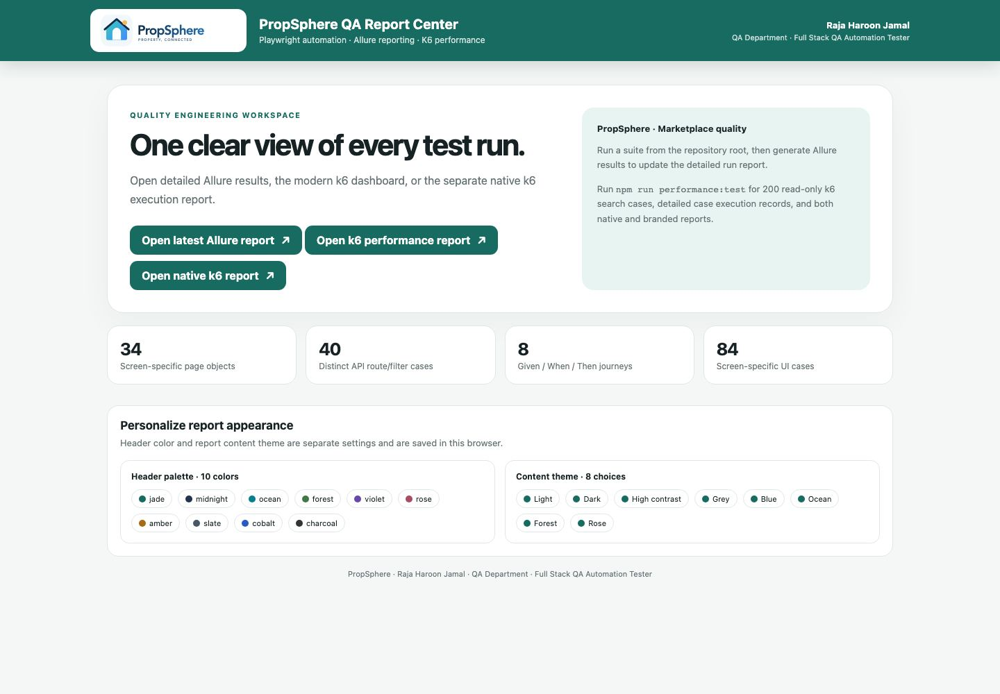

**Allure overview — run totals, UI/API/BDD/database links, and evidence summaries**

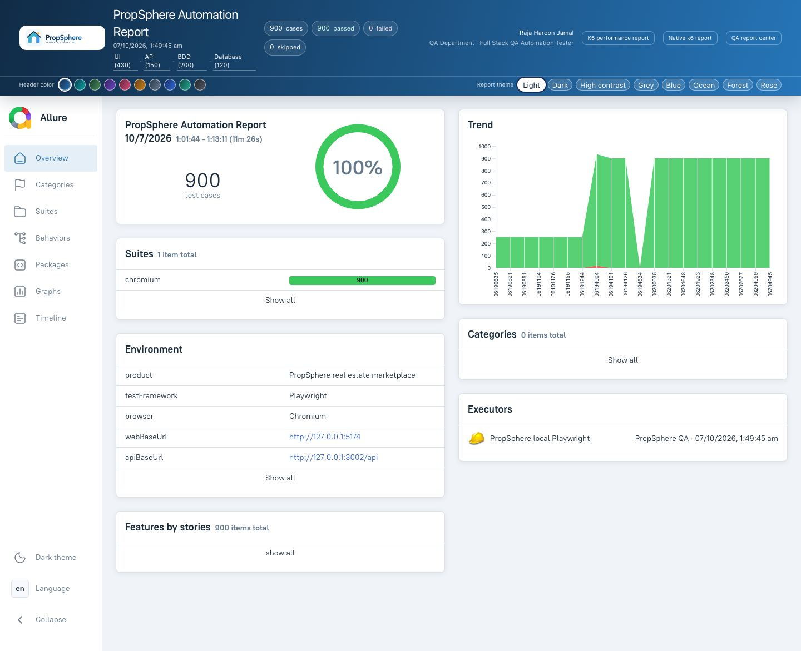

**Categories — 900 total, 900 passed, zero failed or skipped, with suite/category coverage**

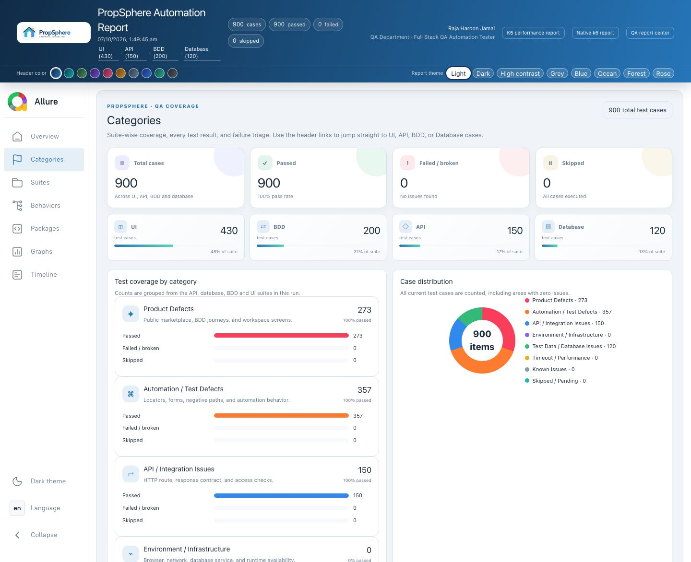

**Suites — expanded spec tree with per-file case totals**

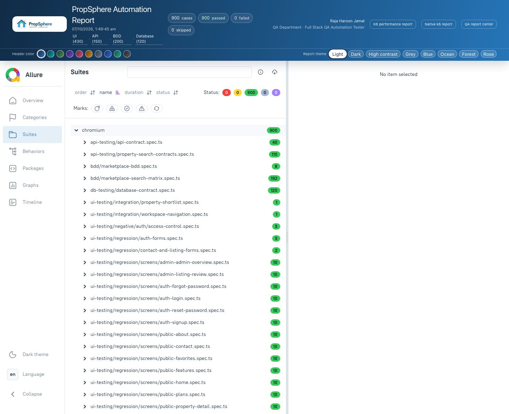

**Behaviors — named test cases grouped by application behavior**

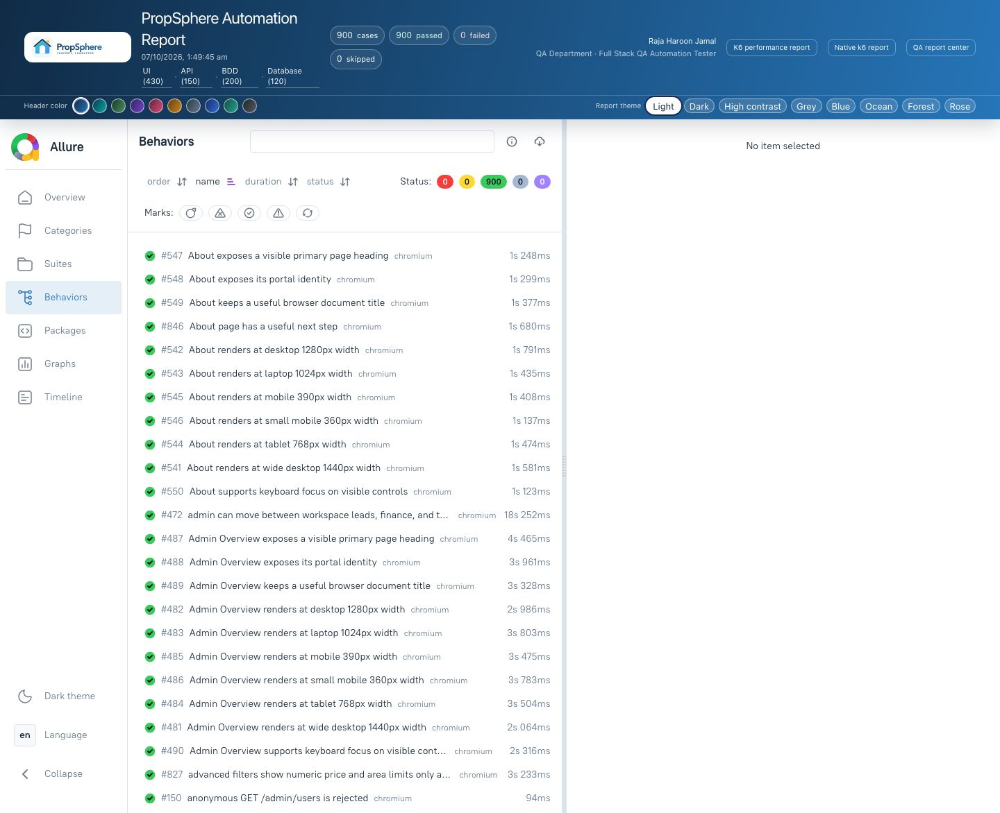

**Test case details — execution steps/hooks plus attached screenshot and video evidence**

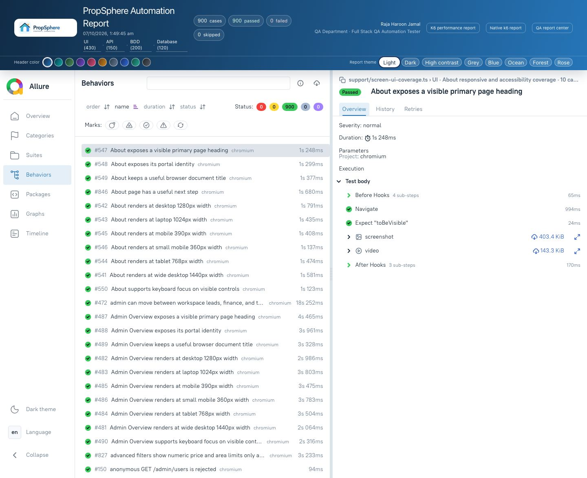

**Packages — expanded API, BDD, database, UI, and support test groups**

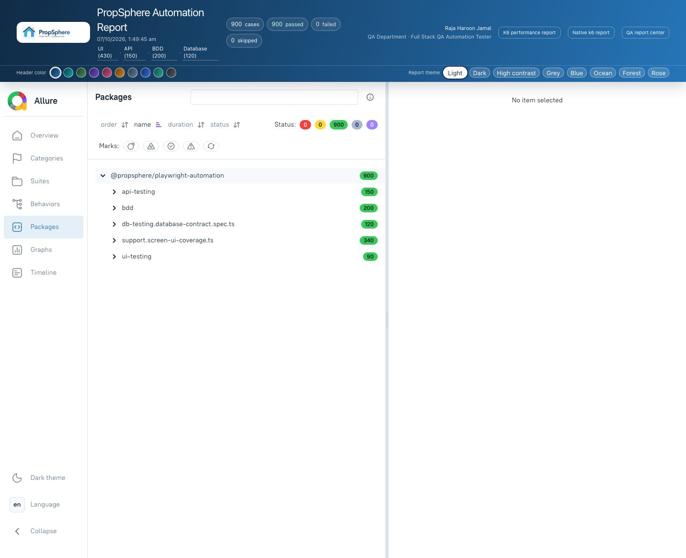

**Graphs — seven native Allure analytics: status, severity, duration, three trends, and retries**

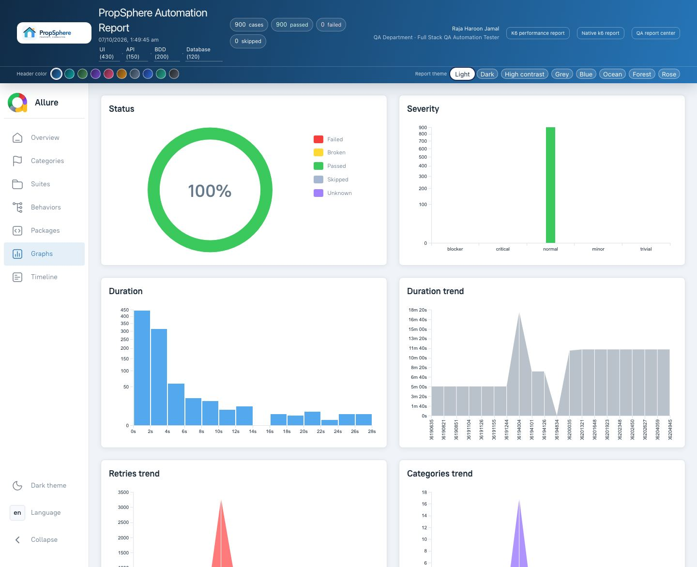

**Timeline — the run's test execution distribution**

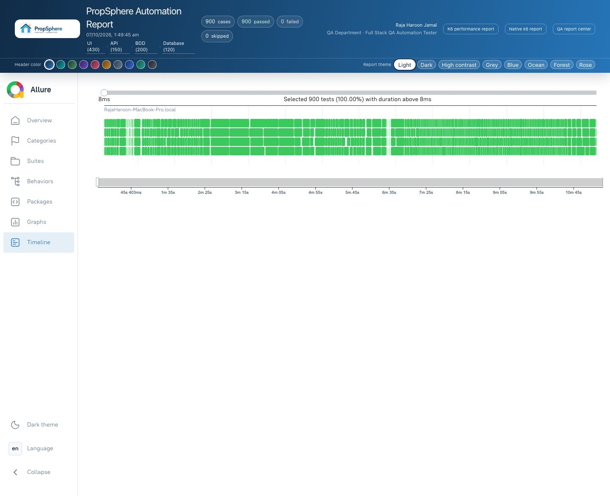

</details>

### k6 performance workflow

Install k6, configure `API_BASE_URL` if needed, and run the 200 named, read-only property search cases:

```sh
npm run performance:test
npm run performance:report
npm run automation:report:serve
```

`performance:test` executes the workload and writes raw k6 JSON, the native `handleSummary()` JSON/text output, CLI output, and report data in the ignored `automation/performance-testing/k6/report-output/` directory. `performance:report` rebuilds both HTML views from existing run data without executing k6 again. The main dashboard at `http://127.0.0.1:4178/performance/index.html` shows latency percentiles, throughput, thresholds, executor configuration, and a searchable table with a direct detail view for each case. Each case detail includes its request/query, response code and size, timing breakdown, checks, scenario, executor, VU, iteration, and timestamp. The separate `http://127.0.0.1:4178/performance/native-k6-report.html` exposes k6's native summary, thresholds, execution profile, CLI output, and JSON data.

<details>
<summary>Fresh screenshots: k6 dashboard, case execution, and native report</summary>

**Main k6 dashboard — percentile metrics, thresholds, executor profile, and case table**

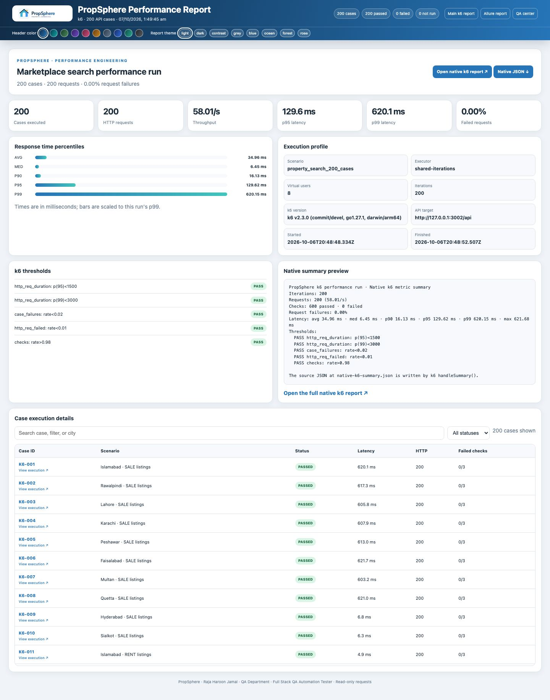

**One case opened directly — request, execution metadata, timing, and individual checks**

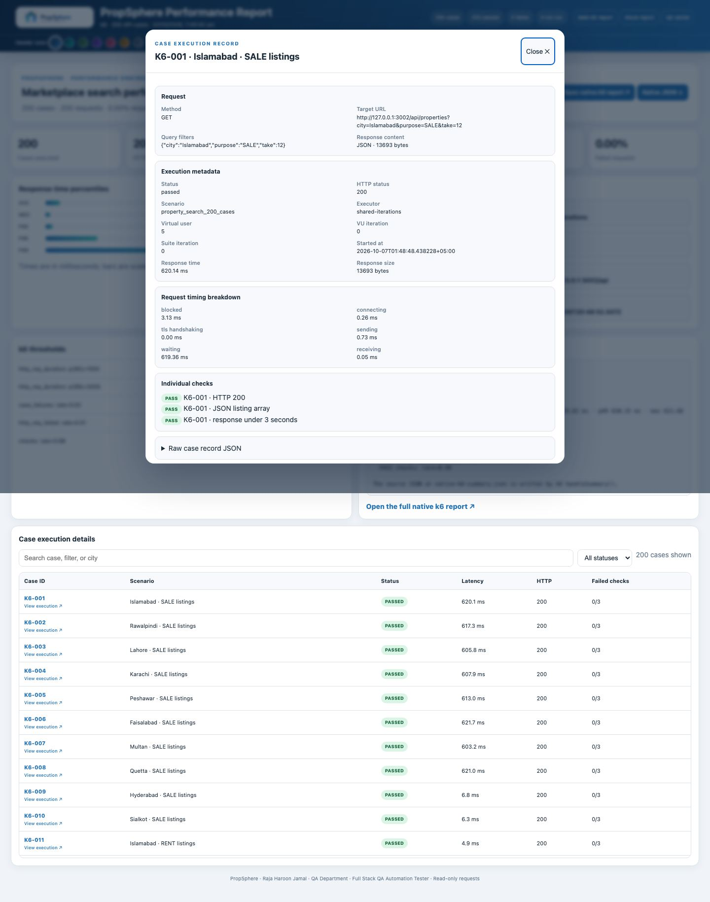

**Native k6 report — original summary metrics, thresholds, executor data, CLI output, and JSON**

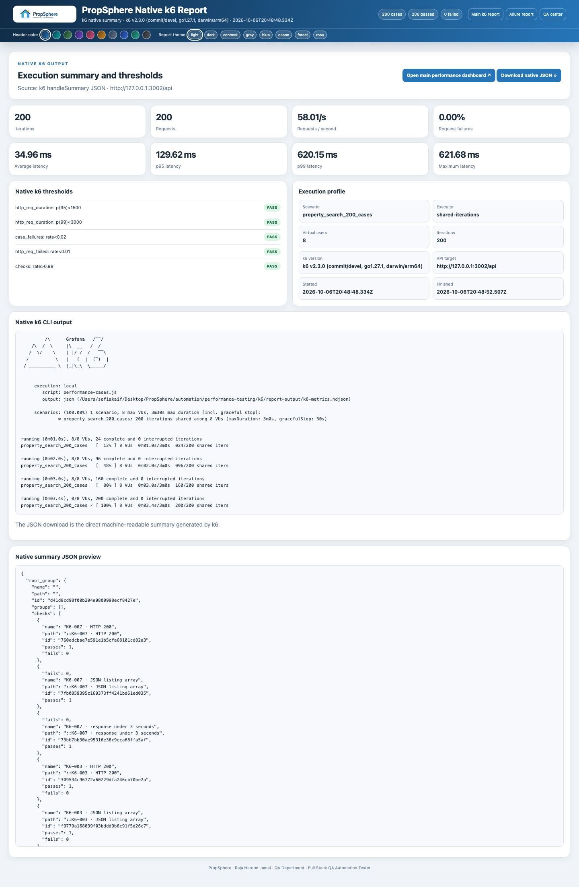

</details>
