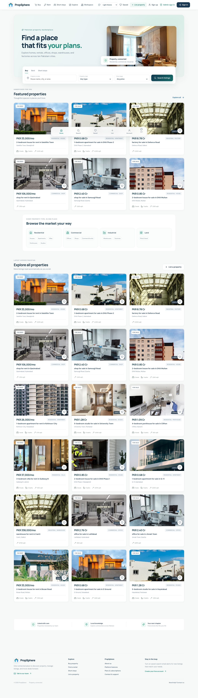
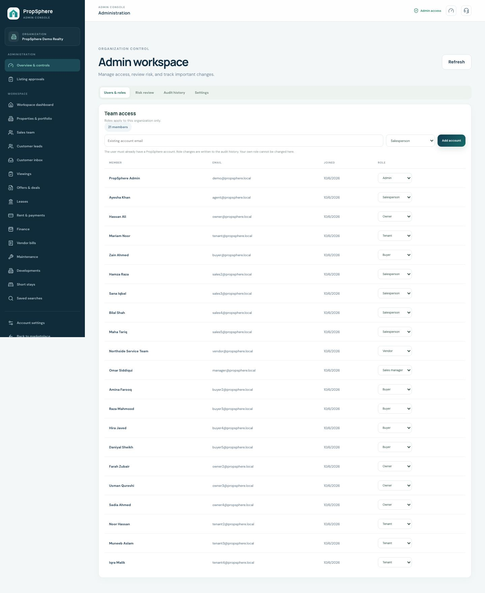
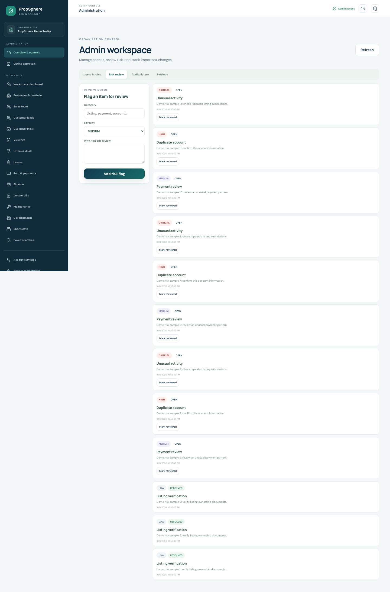
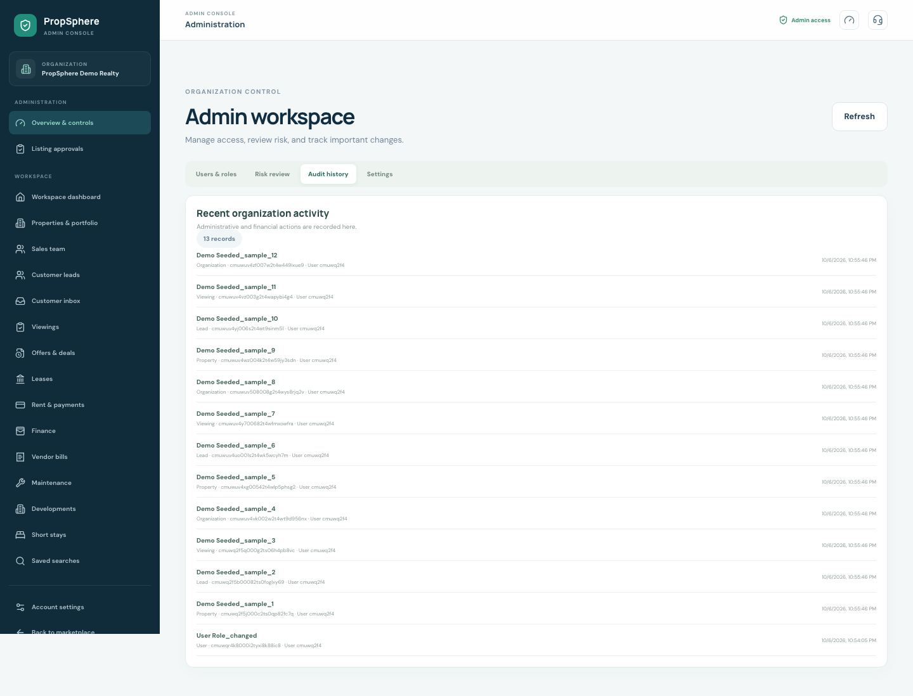
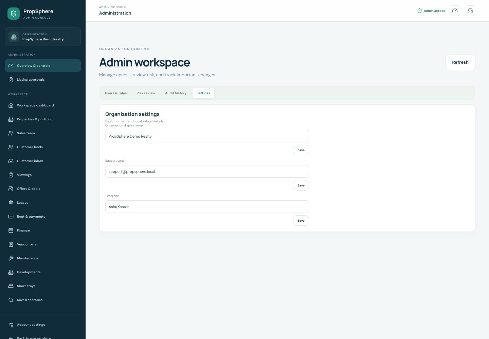
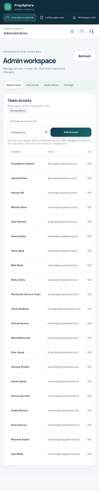

> [Back to the main PropSphere README](../../README.md)

# PropSphere project screenshots

These screenshots were captured from the running app on **October 6, 2026** using seeded demo data. Desktop captures use a 1440 px viewport; the two mobile captures use a 390 px viewport. The images show illustrative sample records, not live property offers. Select any thumbnail to open its full-size capture.

## Latest project captures · October 7, 2026

The homepage and signed-in admin overview below are the newest app captures. They verify the public PropSphere wordmark and admin sidebar mark. The larger gallery that follows contains the section-by-section product screenshots captured on October 6.

**Marketplace home — public navigation, search, listing cards, and footer**

**Admin overview — organization users/roles and PropSphere sidebar logo**

Open the full screenshot gallery (37 captures)

<table>
<tr>
<td> Marketplace home</td>
<td> Buy search</td>
<td> Rent search</td>
<td> Property detail</td>
</tr><tr>
<td> Saved properties</td>
<td> Public short stays</td>
<td> Sign in</td>
<td> Create workspace</td>
</tr><tr>
<td> Forgot password</td>
<td> Set a new password</td>
<td> Submit a listing</td>
<td> Workspace overview</td>
</tr><tr>
<td> Sales lead pipeline</td>
<td> Manager sales team</td>
<td> Viewings</td>
<td> Offers and applications</td>
</tr><tr>
<td> Portfolio and units</td>
<td> Leases</td>
<td> Rent and payments</td>
<td> Maintenance</td>
</tr><tr>
<td> Saved searches</td>
<td> Inbox</td>
<td> Developments</td>
<td> Stay management</td>
</tr><tr>
<td> Finance</td>
<td> Vendor bills</td>
<td> Admin workspace</td>
<td> Admin listing review</td>
</tr><tr>
<td> Access restricted</td>
<td> Page not found</td>
<td> Marketplace home · mobile</td>
<td> Workspace overview · mobile</td>
</tr>
</table>

### Admin console screenshots, section by section

Fresh captures use the seeded demo records. Select a thumbnail to open the full screenshot.

Open the Admin Console sections and all admin workspace screens (21 captures)

**Administration**

| Screen | Screenshot | What is shown |
| --- | --- | --- |
| Users and roles |  | Organization member list, role controls, and account invitation form. |
| Listing approvals |  | Pending listings, property photos, key facts, and approve/reject actions. |
| Risk review |  | Open and resolved risk flags with severity and review actions. |
| Audit history |  | Organization audit events, action names, and affected records. |
| Organization settings |  | Workspace settings and editable configuration values. |
| Admin on mobile |  | Responsive admin navigation and the organization control screen at 390 px. |

**Admin workspace tools**

| Section | Screenshot | Screen details |
| --- | --- | --- |
| Workspace overview |  | Portfolio, leads, viewings, leases, rent, offers, and maintenance KPIs. |
| Properties and units |  | Listing photos, portfolio details, buildings, and rental units. |
| Sales team |  | Five salesperson summaries and organization pipeline totals. |
| Customer leads |  | Contact and property details, lead stage, and follow-up data. |
| Customer inbox |  | Property enquiry conversations and customer message history. |
| Viewings |  | Requested and scheduled property visits. |
| Offers and applications |  | Purchase offers, rental applications, and their current status. |
| Leases |  | Tenants, rental properties, lease dates, and monthly rent. |
| Rent and payments |  | Rent invoices, open balances, receipts, and payment history. |
| Finance |  | Income, expenses, owner payouts, and finance records. |
| Vendor bills |  | Supplier invoices, linked maintenance work, and review status. |
| Maintenance |  | Work orders, priority, service providers, and job status. |
| Developments |  | Projects, unit inventory, reservations, and installments. |
| Short stays |  | Furnished stay listings, nightly prices, and bookings. |
| Saved searches |  | Buyer search criteria and email alert preferences. |

### What each screen and panel does

| Screen | Main panels and purpose |
| --- | --- |
| Marketplace home | Global navigation opens buy, rent, stays, saved homes, workspace, and listing submission. The hero introduces the marketplace; the tabbed search panel filters by city, property type, and price; featured cards open listings; the trust strip summarizes listing review and city coverage. |
| Buy search | Filter bar narrows sale listings by location, type, and price; results toolbar reports matches and sorting; property cards show purpose, price, location, room/area facts, and a save control. |
| Rent search | The same search panels are pre-set for rental inventory; cards show monthly rent and can open details or be saved. |
| Property detail | Gallery presents listing photos; heading shows purpose, title, community, and save/share actions; fact tiles show rooms and area; detail sections show description, attributes, and location; the sticky contact card shows price and viewing/inquiry actions. The inquiry modal collects a message and optional phone and creates a sales lead. |
| Saved properties | Shortlist header explains the saved-items view; property cards reopen a listing or remove it from the saved set; empty state links back to search. |
| Public short stays | Stay cards show city, capacity, nightly rate, and photos; selecting one opens the booking panel with dates, guest count, stay estimate, and request action. |
| Sign in | Branded background, email/password form, sign-in action, password recovery/workspace links, and demo-account hint. |
| Create workspace | Name, work email, organization, and password fields create a new tenant workspace whose first member is its admin. |
| Forgot password | Email form requests a reset link; the response is phrased without revealing whether an account exists. Email delivery needs SMTP configuration. |
| Reset password | Token-based form sets a new password; the screenshot uses a visual-only demo token and is not a usable reset link. |
| Submit listing | Listing form collects title, city/community, purpose, type, price, area, rooms, photo URL, and description; submission enters the admin review queue. |
| Workspace overview | KPI cards summarize properties, viewings, leases, maintenance, leads, invoices, and offers/applications. The shortcut panel links to common tasks; the unit-mix panel summarizes occupancy and links to the portfolio. Values are scoped to the signed-in organization and role. |
| Sales lead pipeline | Nine stage columns show assigned lead cards; each card includes customer contact, property and price, recent activity, note entry, and stage control. Summary counts show won/lost work; the follow-up panel adds and completes personal tasks. Salespeople only receive their assigned leads. |
| Sales team | KPI tiles summarize team size, active leads, won deals, and estimated won value. Team performance rows compare each salesperson; organization pipeline rows expose customer contact and linked property price to Admin/Sales Manager. |
| Viewings | Buyer/tenant form requests a property visit or video call; the schedule list shows date, property, requester, and state; permitted staff can confirm, complete, or cancel visits, while requesters can cancel eligible requests. |
| Offers and applications | The deals screen groups purchase offers and rental applications, shows customer/property/status context, and exposes review or response actions permitted by role. |
| Portfolio and units | Portfolio panels list organization properties and their listing state; property forms create/edit inventory; unit controls show availability and support unit creation for eligible owner/admin users. |
| Leases | Lease list connects property, owner, tenant, dates, and current status; eligible owners/admins can end an active lease, which updates its unit and future invoices. |
| Rent and payments | Invoice rows show property, tenant, due date, balance, and payment state; manual payment entry records cash/bank/cheque; tenants can continue an eligible invoice through hosted checkout when Safepay is configured. |
| Maintenance | New-request panel captures property, issue, category, priority, and details; ticket cards track status, SLA, requester, vendor, and quote; manager controls assign vendors/update status; service-provider panel lists and adds vendors. |
| Saved searches | Saved query cards preserve search filters, let the user enable/disable alerts, and remove obsolete searches; email digests require SMTP. |
| Inbox | Conversation list shows customer and property context; thread header links to the listing; message history preserves the conversation; composer sends a reply and optional SMTP notification. |
| Developments | Project form and selector manage projects; unit inventory records number/floor/rooms/area/price; reservation panel captures customer and deposit; confirmed reservations expose installment scheduling and payment tracking. |
| Stay management | Host workspace lists booking requests and stay details; eligible hosts confirm/reject/cancel requests and guests can review or cancel their own bookings. |
| Finance | Date-range report summarizes rent, expenses, and payouts; expense and payout panels record organization financial entries and track payout completion. |
| Vendor bills | Submitted work invoices show vendor/job/amount and review state; finance/admin/owner roles can approve or reject eligible bills. |
| Admin workspace | Users & roles adds existing accounts and changes organization membership roles; Risk review records and resolves flags; Audit history lists key actions; Settings edits organization display/contact/timezone values. Admin access is enforced on the API. |
| Listing review | Pending property cards show photo, location, type, and asking price; approve/reject actions are restricted to admins and reviewed listings enter/leave public search accordingly. |
| Access restricted | Explains that the signed-in role lacks permission and provides a safe way back. |
| Page not found | Friendly fallback for unknown routes with navigation back to the marketplace. |
| Mobile captures | Home and workspace overview show responsive layouts at a 390 px viewport; navigation and cards adapt for narrow screens. |

The gallery is generated from the running app rather than design mockups. Demo inventory is illustrative: names, prices, listing content, availability, and stock photos are sample data and do not verify a real address or offer.
